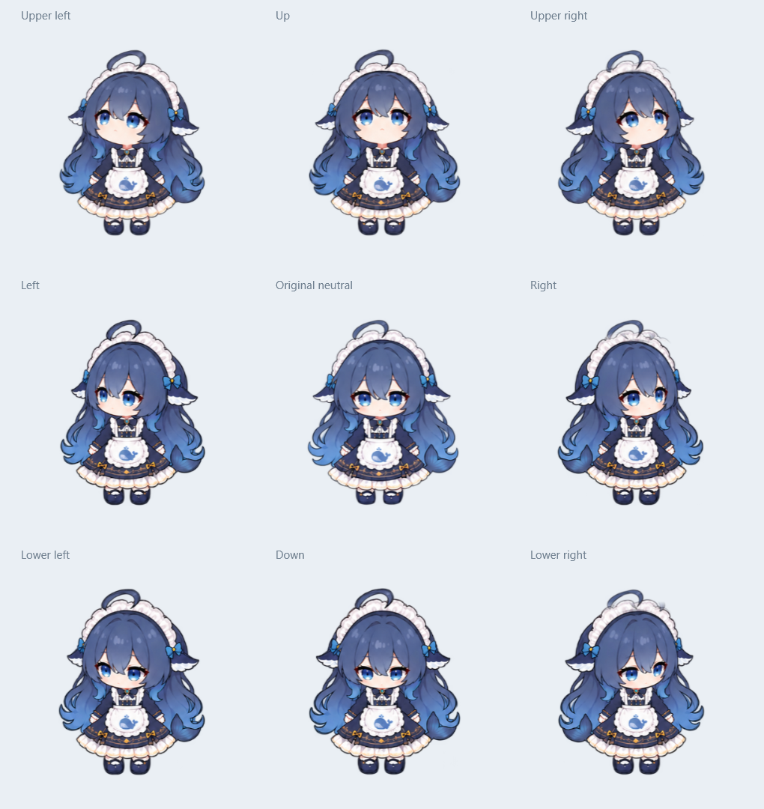

# 大肥鱼桌宠 · v0.9

Windows 原生透明桌宠，支持拖动、鼠标视线跟随、眨眼、起落动画，以及大小和各类动画速度的独立调节。

## 直接运行

下载并解压整个项目，双击根目录的 **大肥鱼桌宠.exe**。需要 Windows 自带的 .NET Framework 4.x；运行无需 Python、Node.js 或安装器。

如果旧版已经运行，请先右键退出旧版，再启动本文件夹的程序。程序通过单实例机制避免重复运行。

- **拖动**：按住鼠标左键移动，播放拎起和落地过渡。
- **视线跟随**：根据鼠标相对位置连续转头，支持八个方向；鼠标静止 5 秒后回正。
- **待机**：轻微呼吸，每 3–5 秒随机眨眼。转头中可以眨眼。
- **大小**：右键 →「调节大小…」，使用滑块或直接输入百分比，如 `125.5`；通常可调 30–200%，上限随屏幕工作区变化。滚轮也可缩放。
- **动画速度**：右键 →「调节动画速度…」，分别调节转头跟随、眨眼动作、待机呼吸、拎起过渡、落地过渡、悬空晃动、点击反馈。支持 `0.25–5` 倍，默认 `1`，转头可先试 `2`。
- 输入后按 **回车** 或移开焦点生效，滑块即时生效。
- 右键菜单还可切换置顶、恢复位置和退出。

倍率只改变相应动作的速度，不改变 5 秒静止计时或 3–5 秒眨眼间隔。位置、大小和倍率自动保存到运行目录的 `data/settings.txt`。该文件包含个人设置，不纳入 Git。

## 这一版的外观

右转时保留正视呆毛方向，头顶连接处渐变衔接。上、左上和右上的抬头幅度略微加大。眨眼只改变对应视角的眼部，保留其他区域与透明通道。



## 项目结构

| 路径 | 内容 |
| --- | --- |
| `大肥鱼桌宠.exe` | 已编译的 v0.9.0.0 程序，可直接运行 |
| `src/PetApp.cs` | 原生窗口、拖动、右键菜单、设置保存 |
| `src/PetAnimation.cs` | 动作时钟、转头追随、姿势和眨眼渲染 |
| `src/PetMotionWarp.cs` | 姿势之间的轮廓补间 |
| `src/AnimationRates.cs` | 七种动画倍率 |
| `src/NumericSettingRow.cs` | 滑块与数值输入控件 |
| `assets/animations/v5` | 当前图集、定位数据、位移数据和抬头生成源图 |
| `assets/reference` | 原始角色参考图 |
| `tests` | 原生 WPF 动画与输入回归检查 |
| `docs/previews` | 当前版本预览图 |

全部运行素材嵌入 EXE。已提交完整构建所需资源，不需要重新生成图片或计算位移数据。

## 从源码构建

在本文件夹打开 PowerShell：

```powershell
powershell -NoProfile -ExecutionPolicy Bypass -File .\build.ps1
```

默认生成根目录的 EXE；如果它正在运行，请先退出，或指定其他输出路径：

```powershell
.\build.ps1 -OutputPath .build\PetAnimated.exe
```

使用 Windows .NET Framework 自带的 C# 编译器，无需安装额外构建包。

## 验证

```powershell
powershell -NoProfile -ExecutionPolicy Bypass -File .\tests\check.ps1
```

检查各类动画倍率、数值输入和持久化序列化、八方向跟随、静止回正、拖拽状态连续性、眨眼区域像素不变性，以及不同大小的透明边界。输出图与中间文件写入忽略目录 `demo/animation-qa` 和 `.build`。

v0.9 已通过 496 次原生 WPF 渲染检查。离屏检查不等同于显示器实际帧率测量；最终观感以桌面实际运行效果为准。

本仓库是当前版本整理快照，不包含旧实验版本、依赖缓存、录屏或个人运行设置。未指定开源许可证。
